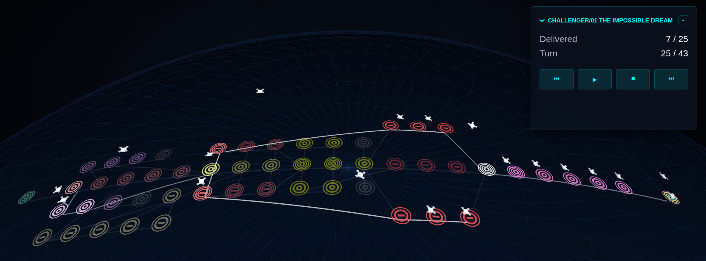
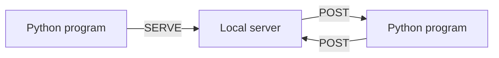
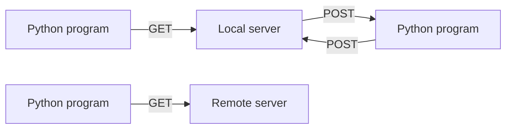
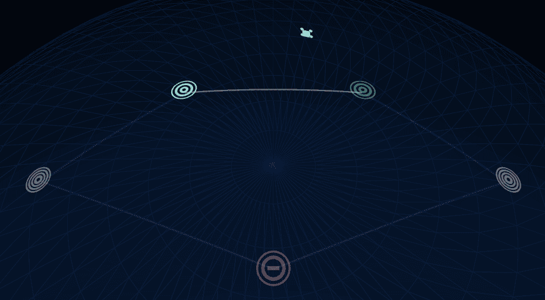
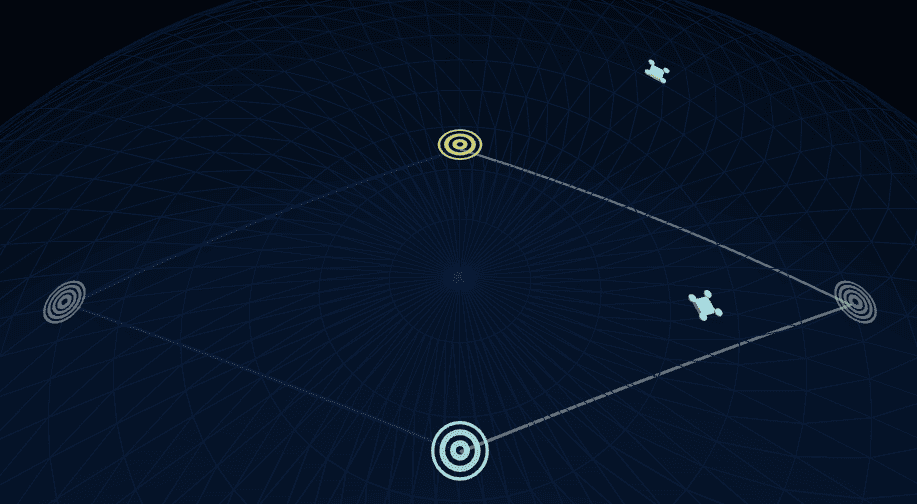
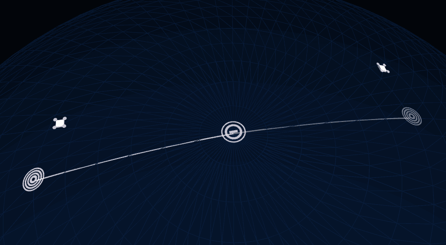

*This project has been created as part of the 42 curriculum by seoliver.*

Fly in ~ <em>3Drones</em>
======

**Description**

<div align="center">


Fly in - 3Drones is an advanced, object-oriented Python simulation engine that coordinates in real time the flight of a group of drones so that they follow the most optimized path to their destination.

To do so, it parses map data, applies capacity and congestion rules, computes a turn-by-turn route plan that is delivered in the CLI and to the browser for a 3D visualization.

</div>

Instructions
-----------
### Install

```bash
make install
```
Initializes  a **virtual environment** and install required **dependencies**.

### Execution
```bash
make run MAP=maps/medium/02_map.txt
make run MAP=maps/medium/
```

Runs the pathfinding simulation on the specified map or all maps contained in the specified folder. `make run` accepts several flags:
- `-visual` Pushes the simulation to the browser for 3D visualization.
- `-hide-turns` Runs the simulation without printing the step-by-step turn output.
- `-export` Exports the simulation data to a static `.data` file.

### Server
```bash
make serve
```
Set up the local FastAPI **server**, open a **browser** window and establishes **bidirectional communication** between the python backend and the javascript front end.


```bash
make stop
```
Hunts down and gracefully terminates any background Uvicorn servers keeping port 8080 open.

### Development

```bash
make debug
```
Runs the main script in debug mode using Python's built-in debugger (`pdb`).

```bash
make lint
make lint-strict
```
Check right syntax of **flake8 & mypy**. 


```bash
make clean
```
**Removes** temporary artifacts, cache and other unnecessary folders and files. This removes generated caches and the local virtual environment.


## API and communication

The backend is powered by FastAPI and serves both the frontend and the simulation API.

### Available routes

- `GET /` serves the frontend page
- `GET /api/maps` lists the map files located under [maps](maps)
- `POST /api/simulate` runs a simulation for a selected map

### Example request

```json
{
  "map_name": "easy/01_linear_path.txt"
}
```

### Response fields
The simulation endpoint returns:

- `map_name`
- `map_data`
- `timeline`
- `total_turns`
- `turns_output`

### POST
Allow continuous and bidirectional communication between the server running the fly-in Python program and the browser displaying the JavaScript frontend. 


### GET
Allows that a standalone visualization can be pushed to a local or remote endpoint.


### Simulation Protocol
I developed a specific custom codification protocol for the simulation data, it avoids the character bloating of sending it using json and base64. It codified the data by levels of separation that use the set of chars called unreserved url characters. The separators used, in order of decreasing magnitude, are `~ / .` while the characters `- _` are reserved for data names. 


The project uses a compact custom encoding to reduce payload size before sending visualization data. The general structure is:

```txt
Map_name~Drone_number~Hubs~Connections~Turns_moves
```

This format keeps the visualization payload much lighter than a verbose JSON representation while preserving the data needed for the browser to replay the path:
It greatly decreases transfer size, for example compare:

<table vertical-align="top" align="center"><tr>
<th>JSON of a hub</th>
<th>Codified in base64</th>
<th>Custom codification</th>
</tr><tr>
<td valign="top">

    "restricted_tunnel1": {
        "x": 4,
        "y": 0,
        "zone_type": "restricted",
        "max_drones": 2,
        "color": "red"
    }
</td>
<td><pre>
ICAgICJyZXN0cmljdGVkX3R1bm5lb
DEiOiB7CiAgICAgICAgIngiOiA0LA
ogICAgICAgICJ5IjogMCwKICAgICA
gICAiem9uZV90eXBlIjogInJlc3Ry
aWN0ZWQiLAogICAgICAgICJtYXhfZ
HJvbmVzIjogMiwKICAgICAgICAiY2
9sb3IiOiAicmVkIgogICAgfQ==
</pre></td>
<td valign="top"><pre>
restricted_tunnel1.4_0_r2_red
</pre></td>
</tr><tr>
<td>Length: <strong>95</strong> chars</td>
<td>Length: <strong>201</strong> chars</td>
<td>Length: <strong>30</strong> chars</td>
</tr></table>


## Maps

Map files are stored in plain text with a special syntax.

### Blueprint
```txt
nb_drones: 10

start_hub/hub/end_hub: base 0 0 [color=red]
hub: midpoint 1 0 [zone=normal|priority|restricted|blocked max_drones=2]
end_hub: destination 2 0 [color=green]

connection: base-midpoint [max_link_capacity=2]
connection: midpoint-destination
```

### Examples
These maps exemplify criteria to consider:

<table width="100%" vertical-align="top" align="center"><tr>
<td width="25%" vertical-align="top">

```txt
nb_drones: 1
start_hub: start 0 0
hub: a 5 2 [zone=restricted color=red]
hub: b1 3 -2 [zone=priority color=green]
hub: b2 7 -2 [zone=priority color=green]
end_hub: end 10 0
connection: start-a
connection: a-end
connection: start-b1
connection: b1-b2
connection: b2-end
```
</td><td align="right">

</td></tr></table>

**Example 1.**
The drones should take route b because it has priority. The BFS [Breadth First Search ](https://www.geeksforgeeks.org/dsa/breadth-first-search-or-bfs-for-a-graph/) algorithm wrongly directs by route a because it has one step less. On the other side, a weighted Dijkstra algorithm takes into account that path a has restricted zones which use double turns (so both paths actually take 3 turns to reach the end) and that path b has priority zone discounts.

<table width="100%" align="center"><tr>
<td width="25%" vertical-align="top">

```txt
nb_drones: 2
start_hub: start 0 0
hub: a 5 2 [max_drones=1 color=blue]
hub: b 5 -2 [max_drones=1 color=yellow]
end_hub: end 10 0
connection: start-a
connection: a-end
connection: start-b
connection: b-end
```
</td><td align="right">

</td></tr></table>

**Example 2.** 
Both drones should depart and arrive at the same time. The algorithm schedule paths to maximize capacity by distributing drones across multiple paths. A bad algorithm could send every drone to the same "best" path, which causes bottlenecks. Instead the algorithm adds a micro-penalty to occupied nodes to naturally split traffic. In the simulation D1 picks a, when D2 calculates its route detects that a is occupied and has a higher cost so dynamically routes via b.

<table width="100%" align="center"><tr>
<td width="25%" vertical-align="top">

```txt
nb_drones: 2
start_hub: start 0 0
hub: restr 5 0 [zone=restricted]
end_hub: end 10 0
connection: start-restr
connection: restr-end
```
</td><td align="right">

</td></tr></table>

**Example 3.** 
The second drone can not enter the restricted area until the first drone has left it. After the first turn the drone 1 is still in transit to restr. A mistake could make that drone 2 depart because the restr hub is not occupied. Therefore we must take into account that the middle hub has one drone in transit so they cant accept another occupant.

## Algorithm
The core pathfinding engine relies on a custom implementation of a **Dynamic Dijkstra** algorithm. 

Because the simulation requires moving multiple drones simultaneously while respecting node limits, a static shortest-path algorithm is insufficient. The engine handles this by calculating routes turn-by-turn and dynamically updating connection weights based on real-time traffic:
- **Base Weights:** Standard zones cost 1 turn. Restricted zones cost 2 turns. Priority zones are heavily favored, and blocked zones are completely pruned from the search tree.
- **Dynamic Penalties:** The algorithm adds progressive penalties (+0.1 to +1.0) to zones and connections that are approaching their `max_drones` or `max_link_capacity` limits. This forces later drones to path around congested bottlenecks rather than deadlocking.
- **Trap Detection:** A layer detects dead-ends and trap paths actively discounting alternative routes to ensure drones do not get stuck waiting indefinitely in 1-capacity corridors.

### Cost factors
The search adds a higher cost when a route:

- goes through a blocked hub
- approaches a full hub that is not the destination
- uses a saturated connection
- traverses a restricted zone
- enters a region with trap-like congestion patterns

This is not a pure shortest-path calculation. It is a weighted routing heuristic that balances distance and stability.

The project is designed for maps where naive shortest-path routing fails because of:

- blocked corridors
- restricted tunnels
- hub congestion
- dead-end patterns
- route saturation over time

## Simulation behavior
The visualization engine translates the discrete terminal outputs into a fluid, interactive 3D scene using Three.js.

- Spatial Awareness: Instead of reading a wall of text, the flat 2D map coordinates are mapped onto a 3D spherical planet, providing a clear visual hierarchy of the network's topology.
- Interactive Inspection: Users can freely rotate the camera, zoom in on traffic jams, and hover over specific hubs to see their exact capacities and zone types (highlighted by glowing emissive rings).
- Timeline Scrubbing: The UI includes playback controls (Play, Pause, Fast-Forward, Rewind) that interpolate the drone positions between turns, making it exceptionally easy to debug collisions, deadlocks, or routing inefficiencies frame-by-frame.

The simulation runs turn by turn. On each turn, drones may:

- move into a normal hub
- wait in their current hub
- pass through a restricted zone
- be blocked by full hubs or saturated links
- arrive at the destination and be marked as delivered

The engine keeps occupancy counts and uses them during route selection so the system avoids unrealistic overload patterns.


## Features

 This project combines:

- dynamic routing engine based on a Dijkstra-inspired search
- strict parsing and validation of map files, hubs and connections
- FastAPI backend for serving the frontend and exposing simulation endpoints
- browser visualizer powered by Three.js
- CLI workflow for local runs, batch simulation and export of payloads

### Multi-drone route planning
The simulator manages multiple drones at once. Each drone has a current position, transit state, and delivery status, and the engine updates them turn by turn while tracking occupancy and route availability.

### Dynamic map rules
The routing logic responds to different hub and connection states:

- normal hubs
- blocked hubs
- restricted hubs
- priority hubs
- start and end hubs
- hub occupancy limits
- connection capacity limits

This makes the simulation behave more like a constrained traffic network than a plain shortest-path problem.

### Congestion-aware pathfinding
The optimizer uses weighted costs during route search. Costs rise when:

- a target hub is full
- a connection is already saturated
- a route adds congestion to a busy region
- the path enters a trap-like pattern
- a restricted zone is entered while occupied

The result is a more stable and realistic path than a pure distance-minimizing search.

### Deadlock and trap detection
The engine checks for unsolved states and trap-like patterns. If a map becomes impossible to complete, it stops with an error instead of silently producing a broken simulation.

### Browser visualization
The project can open a browser window connected to the local backend and render the map and drone movements in a live scene using static assets and a Three.js frontend.

### API support
The backend exposes:

- a homepage for the frontend
- a map list endpoint
- a simulation endpoint that runs a map in the backend

### Batch simulation
You can run an entire folder of maps sequentially, which is useful for validating many scenarios or puzzle layouts.

### Export support
Simulation data can be exported as a compact compressed payload under the static data folder for later visualization or replay.


## Resources

- Three.js Documentation - Core 3D rendering concepts and spherical math.
- FastAPI Documentation - Python asynchronous web framework routing.
- Dijkstra's Algorithm - Foundation for the pathfinding engine.

**AI Usage Disclosure:**

Artificial Intelligence was utilized during the development of this project to assist with refactoring procedural code into a Three-Tier Object-Oriented Architecture, optimizing the Three.js rendering loop (specifically vector math and requestAnimationFrame cleanup), and structuring custom serialization parsers. All generated concepts were peer-reviewed, heavily modified, and thoroughly understood before implementation to ensure code integrity and prevent blind spots.

